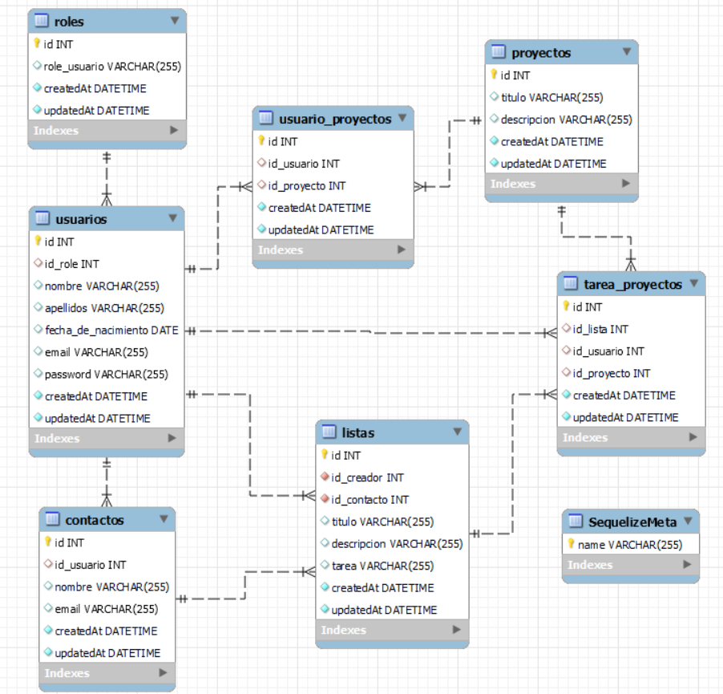

# Proyecto Final Backend

<details>
  <summary>Contenido 📝</summary>
  <ol>
    <li><a href="#objetivo">Objetivo</a></li>
    <li><a href="#sobre-el-proyecto">Sobre el proyecto</a></li>
    <li><a href="#stack">Stack</a></li>
    <li><a href="#diagrama-bd">Diagrama</a></li>
    <li><a href="#instalación-en-local">Instalación</a></li>
    <li><a href="#endpoints">Endpoints</a></li>
    <li><a href="#agradecimientos">Agradecimientos</a></li>
    <li><a href="#contacto">Contacto</a></li>
  </ol>
</details>

<!-- 
## Deploy

<!-- <p>Click <a href="">hear </a>for go to the databases in Railway</p> -->

## Objetivo

Realizar una API funcional conectada a una base de datos, en este caso se realizo de una Aplicación para crear Proyectos y listas de tareas con relaciones entre proyectos, lista y usuarios.

## Sobre el proyecto

La idea del proyecto es que los usuarios puedan registar, loguear, puedan crear proyectos en los cuales se añadan listas de tareas y a su vez puedan agregar contactos. Los proyectos y las tareas se pueden crear, modificar y eliminar, hay restrición entre los usuarios que son parte de la lista y quien creo las tareas.

## Stack

Tecnologías utilizadas:

<div align="center">
<a href="https://sequelize.org/">
    
</a>
<a href="https://www.expressjs.com/">
    
</a>
<a href="https://nodejs.org/es/">
    
</a>
<a href="https://developer.mozilla.org/es/docs/Web/JavaScript">
    
</a>
<a href="https://www.postman.com/">
    
</a>
 </div>

## Diagrama BD



## Instalación en local

1. Clonar el repositorio
2. `$ npm install`
3. Conectamos nuestro repositorio con la base de datos
4. `$ Ejecutamos las migraciones`
5. `$ Ejecutamos los seeders`
6. `$ npm run dev`
7. ...

## Endpoints

<details>
<summary>Endpoints</summary>

- AUTH

- REGISTRAR USUARIO

       POST http://localhost:3000/auth/register/

  body:

  ```js
   {

       "nombre": "Luisito",
       "apellidos": "Comunica",
       "fecha_de_nacimiento":" 2000-05-05",
       "email": "luis@correo.com",
       "password": "12345678"

   }
  ```

- LOGIN

       POST  http://localhost:3000/auth/login

  body:

  ```js
  {
      "email": "jose@correo.com",
      "password":"12345678"
  }

  ```

- USUARIO

- VER PERFIL DE USUARIO

        GET  http://localhost:3000/usuarios/get-Profile

- MODIFICAR PERFIL DE USUARIO

      PUT  http://localhost:3000/usuarios/update-profile

  body:

  ```js
  {
      "nombre": "cesar",
      "apellidos": "Pala"
      ...
      ...
      ...
  }

  ```

- PROYECTOS

- CREACION DE PROYECTOS

       POST  http://localhost:3000/proyectos/create-proyecto

  body:

  ```js
  {
      "titulo": "Prueba ",
      "descripcion": "prueba de creacion de proyecto"
  }

  ```

- VER PROYECTOS COMO CREADOR

       GET  http://localhost:3000/proyectos/proyecto

- MODIFICAR PROYECTOS COMO CREADOR

      PUT  http://localhost:3000/proyectos/update-proyectos/1

  body:

  ```js
   {
      "titulo": "prueba para modificar proyectos",
      "descripcion": "prueba"
   }

  ```

- ELIMINAR PROYECTOS

       DELETE  http://localhost:3000/proyectos/delete-proyectos/1

- LISTAS DE TAREAS

- CREAR LISTA DE TAREAS

       POST  http://localhost:3000/tareas/crate-tarea/1

  body:

  ```js
    {
      "id_contacto":1,
      "titulo": "Prueba ",
      "descripcion": "prueba de creacion de tarea",
      "tarea": "prueba de cracion de tarea"
    }

  ```

- VER TUS TAREAS ASIGNADAS

      GET  http://localhost:3000/tareas/tarea

- VER TODAS LAS TAREAS Y CONTACTOS ASIGNADOS A UN PROYECTO

      GET  http://localhost:3000/usuarios/lista-tarea-proyecto/1

- MODIFICAR LISTA DE TAREAS

      PUT  http://localhost:3000/tareas/update-tareas/1

  body:

  ```js
  {
    "id_contacto":1,
    "titulo": "Prueba MODIFICACIÓN",
    "descripcion": "prueba de MODIFICACIÓN de tarea",
    "tarea": "prueba de MODIFICACIÓN de tarea"
  }

  ```

- ELIMINAR TAREAS

      DELETE http://localhost:3000/tareas/delete-tareas/1

- ADMIN

- VER TODOS LOS USUARIOS REGISTRADOS

       GET  http://localhost:3000/usuarios?page=1

  </details>

## Agradecimientos:

Agradezco a:

- **_Prof. Fidel Guilart_**
- **_Prof. Mara Scampini_**
- **_Prof. Jose Marín_**
- **_ y compañeros . . ._**

## Contacto

**_César Parada_**  
<a href="https://github.com/Cesarparada" target="_blank"></a>

<a href="mailto:cesard.0925@gmail.com"></a>

<a href="https://www.linkedin.com/in/linkedinUser/" target="_blank"></a>

</p>
